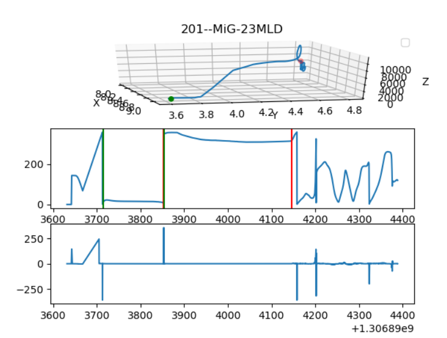

# Instructions

Since we want to compare computed values between your program and ours for every tests, we need to set up some ground rules. You will need constants. We list here some constant values you might need. 

**<ins style="color:red;">Important</ins>**: If you need another constant, let us know. Call us, or even better, use the git repository to [open an issue](https://github.com/Estia-advanced-programming/pandora-public/issues). We will then update this page so that everyone can use the same values.


<!-- * **Decimal**: Round your decimal values to 2 digits (e.g., `1234.5678` becomes `1234.57`) -->

## Constant Values

* Distances:
	* 1 m = `3.281` ft

* Weights:
	* 1 kg = `2.205` lbs

* Power:
	* 1 hp = `754.7` W

* Temperature:
	* 1 K = ℃ - `273.15`

* Pressure
	* 1 psi = `6894.76` Pa

* Speed:
	* 1 kts = `1.852` km/h
	* 1 mph = `1.609` km/h
	* `1225` km/h = 1 Mach
	* Classification:
		* Subsonic: Mach < 1.0
		* Transonic: Mach = 1.0
		* Supersomic: Mach > 1.0
		* Hypersonic: Mach > 5.0
	* 1 g = `9.80665` m/s2


* Earth radius: `6,371` km

## Computations

* Distance between 2 longitude/latitude coordinates: see this [link](http://www.movable-type.co.uk/scripts/latlong.html) (uses the `haversine` formula)

* Approximation for speed and acceleration data for the first point (respectively the first two points): `repeat` the first value

* ℃ to radian conversion: Use the Java built-in method `Math.toRadians(...)`

## Timestamp

You can convert double values to Instant Java objects.
In this case, you can access quick display options (via `DateTimeFormatter`). For this, you need to define a zone. Use the `.withZone(ZoneId.systemDefault())`. (Check this [forum thread](https://stackoverflow.com/questions/25229124/format-instant-to-string) for more examples).

### Clue
All flights happened around 8:00am in a particular timezone. With your system timezone, these flights should be around 4:00am.


## Special Situations

* if a phase is not detected, report: `phase_name: not detected`
* if no phase has a O2 concentration > 50%, report `oxygenPhase: none`

## Metadata

* Required information are:
	* flight id
	* flight code
	* origin
	* date
	* from
	* to
	* motor(s)

* Optional parameters:
	* mass aircraft
	* mass fuel
	* lift coef
	* drag coef


## Flight Phases

For those interested, you can read research paper [1] or thesis [2] for free.

### Concept
In this project, we will implement a very simplistic heuristic: we will simply look at the `yaw` value. If it is relatively constant, it is a **cruise** phase. Whatever happens before the first cruise phase is the **take off** phase, whatever remains after the last cruise phase is the **landing** phase.



> _Fig. 1 Illustration of flight phases simple heuristic in our project. 
 Top: Flight path.
 Middle: Yaw values. A green line indicates the beginning of a plateau. A red line indicates the end of a plateau. (Note that the green and red lines in the middle are merged on this example)
 Bottom: Yaw delta values_

### Algorithm

1. Take the yaw values
1. Take the delta values (simple difference between `i` and `i-1`)
1. Consider delta values that are 
	1. **smaller than 1**
	1. for yaw values that are **different from -1** (default values when the sensors are not turned on yet)
	1. after at least **10 delta values were greater than 1** (To make sure we do not get first plateau happening before any yaw consequent modification)
1. A plateau is defined as a portion in time for which values delta values are < 1 **and for at least 60 seconds**

> Note
With this pseudo-algorithm and its heuristics, most flight analyses make sense.
Only one flight (RU) will have an undetected take off phase.

```python
def findPlateaux(values, timestamp) :
	
	## PREPARE THE DATA #########################

	# get the delta
	delta = delta(values)				# no need for delta time division
	# get the indexes we are interested in
	# we want the index for which
	#		* yaw values != -1
	#		* delta values < 1
	#		* after at least 10 deltas > 1 happened (to make sure the sensors were correctly switched on!)
	indexes = delta.where(<1 and values != -1 and turbulences_happened = True)					# !Important: threshold of 1 
	# get the distance between these indexes
	distance_index = diff(indexes)
	start, end  = None
	array = []

	## MAIN LOOP #########################
	loop on i:
		if start_plateau_detected:
			save(start)
		if end_plateau_detected:
			save(end)
			save_in_array([start, end])

	## FILTERING #########################
    # filter the saved plateaus to know if they 
    # are long enough in time to be considered
    for start, end in array:
    	if time_between(start, end) > 60 			# !Important: threshold of 60
        save_in_results([start, end])
    return results


def OtherFuntion(...)
    plateaus = findPlateaux(yaws, timestamp)

    take_off = before(plateaus.first())
    landing = after(plateaus.last())
    cruise = plateaus.first.start() to plateaus.last.end()


```


[1] Goblet, Valentine & Fala, Nicoletta & Marais, Karen. (2015). Identifying Phases of Flight in General Aviation Operations. 10.2514/6.2015-2851. [link](https://www.researchgate.net/publication/299610035_Identifying_Phases_of_Flight_in_General_Aviation_Operations)

[2] Goblet, Valentine Pascale. "Phase of flight identification in general aviation operations." (2016). [link](https://docs.lib.purdue.edu/cgi/viewcontent.cgi?article=1807&context=open_access_theses)


