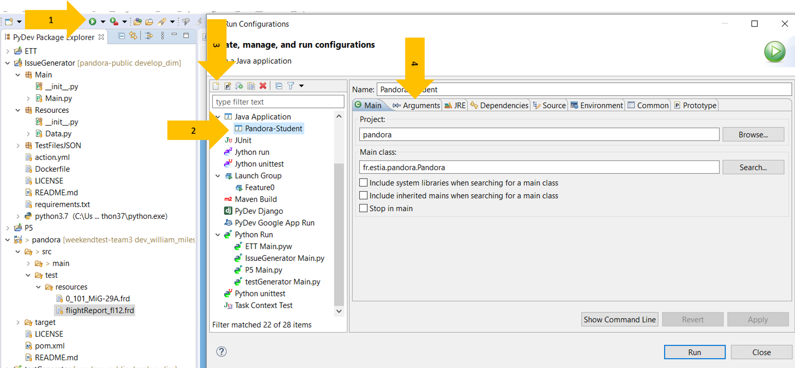

# Pandora Java Project

## Eclipse

You already cloned the application skeleton on your computer. This means you are ready to start working on a local version of the program.

* First, open Eclipse
* Select 'File', and 'import...'
* Select the 'existing maven project' under the 'maven' directory
* Locate the project you cloned from GitHub

And everything should (nearly) be ready to run.

## Running Pandora

In order to run, the program expects some arguments. For instance, the command `java -jar pandora.jar -o flightDuration ./src/test/resources/flightReport_fl12.frd` will output the total flight duration logged in the flightReport_fl12.frd file (dummy example).

In order to do so via Eclipse, you should:
* Click on `run configuration` (menu when clicking on the right of the little `run` green icon) (Fig. 1 - 1)
* Select the `Java Application` (Fig. 1 - 2) and click on the 'New' icon (Fig. 1 -3)
* Name it, and click on the `arguments` tab (Fig. 1 -4)
* Type `-o flightDuration ./src/test/resources/0_101_MiG-29A.frd`
* Click `run`

You should see the program running!

> _Fig. 1 Eclipse screenshot for running configuration_

It can be cumbersome to run several configurations. You can of course save your configuration, but also create `launch group` in which you can include as many configuration you set up in sequential order. Otherwise, you can also omit the output option parameter `-o`. In this case **every output** will be printed.

At this point, note that there is nothing else implemented.
A list of options (more than 100) to implement is [available](./Pandora-»-Features), and this is your job to complete the program.