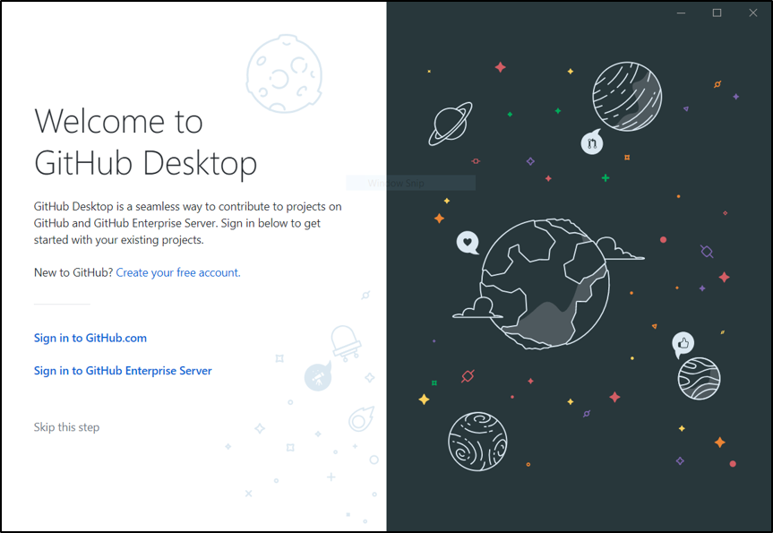
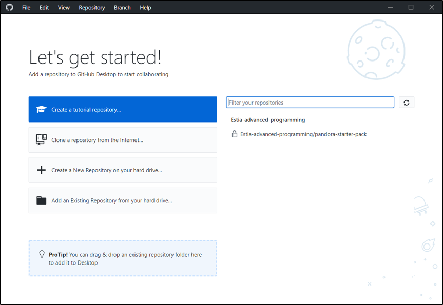

# Pandora Java Project and Git

## Account and Git Client

* Create a user account on [GitHub](#https://github.com/)

* **important** Make sure to disable notifications in your settings. We will create more than 100 issues that you will have to take care of (i.e. implement features, functionalities) and mark them as complete. During the creation, you might get an email for each one of them if you don't disable the notifications!

* Install a git client (e.g., [GitHub Desktop](#https://desktop.github.com/))

* Click on "clone a repository from the internet”

* Select the "**`pandora-template`**" project

* Select the location you want the download to happen on your computer. Remember this location, you will need it to import the project in [Eclipse](./Tutorial-»-Eclipse) later.

* Click "clone"

# Branches

When working with git, you can create, add, delete special tags, which will in turn create what is call branching: your next progress will be identified by this tag. In then end, these tags are useful to track which progress (`commit`) depend on which previous ones. 
This branching is mainly used to develop a feature, a functionality, or anything else that is a little topic on its own. It allows the developer to implement, test, and work on the feature without interfering with the other branches. 

To learn more on Git Branching: [see this link](https://learngitbranching.js.org/)

## Master Branch

The master branch is usually the one where everything works fine. This is the branch we will use to test your program.
It is common to merge and push your current work on 'Master' only when you are sure that:

1- There is no conflict

Make sure you Pull the master branch before trying to pull your work. resolve every potential conflict locally. With this in mind, you will always push a proper version than any new comers could clone and run.

2- Your current task is complete

It is usually not every 5 minutes that people push on the Master branch. You save your work locally (commit), and push on GitHub on your branch when you reached (or think your reached) a consequent step. You can then merge the branch you were working on with Master when the task at hand is completed. You can then ask your team to review your code and accept the merging via a Pull request.

## Pull Request

# Summary

* Create a branch **locally**
	* Name it develop_yourName_NameOfTheFeature
* Code, code, code... Debug, code, code, code
* Commit locally every time that something run
* When the feature is done : Clean up, Comment
* Pull the remote code
* Resolve any conflict that you might have
* Commit, push, and do a pull request
* Continue

# Ressources

Some of the [ressources][github-guide] used to create this page,
[Git handbook][Git-handbook]

[Git-handbook]: https://guides.github.com/introduction/git-handbook/
[github-guide]:https://guides.github.com/
