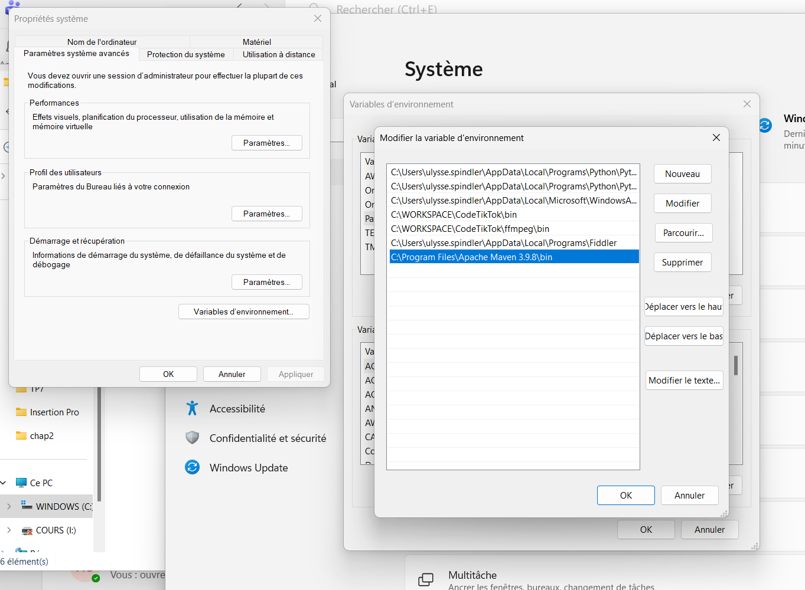

# Maven
Maven is a build automation tool used primarily for Java projects. It helps manage project dependencies, build processes, and project lifecycle. In this section, we will cover how to use Maven to build, run, test, and generate code coverage reports for your Pandora project. The executable is `mvn`, and it should be available in your terminal if you have Maven installed and properly set up in your PATH.

It should be installed on your system. you can check if it is installed by running the following command in your terminal:

```bash
mvn -v
```
if you get an error, it might just be missing from your PATH, you can add it to your PATH : see the [installation instructions](#install-maven) at the end of this page. 


## Build

the best way to build the project is to use maven, it will automatically download the dependencies and build the project for you and produce a jar file in the target folder. To build the project with maven, simply run the following command in the terminal:

```bash
mvn package
```

## Run

you can then run the project with the following command:

```bash
java -jar target/pandora.jar --version
```

or any other options you want to test

## Test

to automatically run the tests, you can use the following command:

```bash
test/autograder.py -t test/testSuite.json -m ./manifest.json target/pandora.jar
``` 

you can also use maven to run the tests and produce a coverage report with the following command:

```bash
or if you want the coverage report as well 
```bash
mvn clean verify
```

in target/site/jacoco/index.html you can find the code coverage report
in target/autograder-output.md you can find the output of the autograder script

## Coverage 

to generate the coverage report, you can use the following command:

```bash
mvn  clean verify jacoco:report
```

# Install Maven


1. **Locate the maven binaries folder:** In the windows search bar type mvn and right click on the maven application and click on "open file location". It should be something like  ```C:\Program Files\Apache Maven 3.9.8\bin```
2. **Add this path to your PATH environment variable:** In the windows search bar type "environment variables" and click on "Edit the system environment variables". In the System Properties window, click on the "Environment Variables" button. In the Environment Variables window, under "System variables", find and select the "Path" variable, then click "Edit". In the Edit Environment Variable window, click "New" and add the path to the maven binaries folder (e.g., ```C:\Program Files\Apache Maven 3.9.8\bin```). Click "OK" to close all windows.

